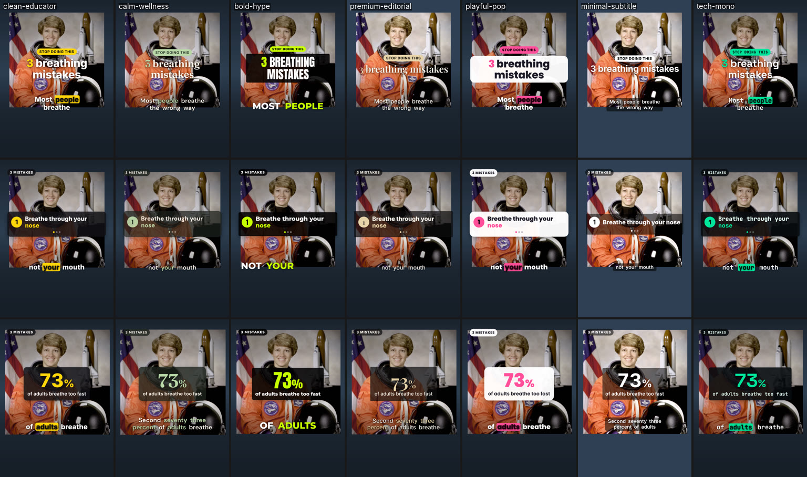

# Insta Reel Editor: an agent skill

Turns a raw clip into a professional **vertical 9:16 Instagram Reel**. The skill transcribes the clip
word by word, cuts silences, fillers and retakes, and reframes it to 1080×1920. It adds word-synced
animated captions and **themed motion graphics driven by the transcript** (hook titles, stats, numbered
lists, callouts, myth vs fact, checklists, CTAs). It mixes voice, music and SFX to −14 LUFS, renders an
Instagram-safe MP4 with a cover, and QA-checks everything against Instagram's UI safe zones.

It is built for educational reels first (explainers, listicles, tutorials, myth-busting, yoga and
exercise demos) and handles stories, podcast clips, hot takes and promos too.



*The same 15 s test edit compiled in all seven bundled themes (sample footage: a public-domain NASA portrait with synthetic voice).*

## How it's built

The skill is philosophy-first, like [LottieFiles' motion-design skill](https://github.com/lottiefiles/motion-design-skill)
(the main reference): the agent decides *what the viewer should feel and do* before touching a tool.
It combines that with the most reliable engineering patterns from other video skills:

| Idea | Borrowed from |
|------|---------------|
| Three pillars, motion personalities, timing and easing tables, severity-tiered quality checklist | LottieFiles motion-design-skill |
| Transcript as the time spine; hard production rules kept separate from taste; strategy confirmation; self-eval on the render with at most 3 loops | browser-use/video-use |
| The agent writes small JSON plans and deterministic compilers write the HTML; lint/check/snapshot gates; caption rail placement and grouping rules | HeyGen HyperFrames (`embedded-captions`, `talking-head-recut`) |
| Thin router SKILL.md with deep references loaded on demand | Remotion skills, Anthropic skill-creator |
| Re-transcribe the render to catch clipped words; cut-quality numbers | claude-youtube-editor `clean-cut` |
| Instagram specs, safe zones, ranking signals, sources dated Oct 2026 | Meta Graph API docs, Instagram creators FAQ, Mosseri, Meta Engineering |

## Install

```bash
# Claude Code (personal skill)
ln -s "$(pwd)/skills/insta-reel-editor" ~/.claude/skills/insta-reel-editor
# or install from GitHub
npx skills add PrajsRamteke/insta-reel-editor-skill
```

Requirements: Python 3.9+ and ffmpeg/ffprobe. Node 22+ (HyperFrames renders the motion graphics; fonts and
GSAP are fetched once from npm). One transcription engine: `pip install mlx-whisper` (Apple Silicon) or
`faster-whisper`, or an ElevenLabs, Deepgram or OpenAI key. Optional: `pip install opencv-python mediapipe`
for face-tracked reframing.

## Example prompts

```
Make an Instagram reel from ~/Videos/breathing-tips.mov. Educational, 30–45 seconds, calm look.
```
```
Add karaoke captions to this clip and cut the ums. No other graphics.
```
```
Turn this 4-minute podcast segment into a 45 s reel. Find the best moment, add the guest's name and a quote card.
```
```
Re-edit the reel: start with the 73% line, make captions bigger, and remove the music.
```

## Structure

```
skills/insta-reel-editor/
├── SKILL.md                     router: decision tree, non-negotiables, pipeline, quick-reference tables
├── director/                    HOW TO THINK
│   ├── reel-philosophy.md       three pillars, three layers, attention budget, authenticity
│   ├── content-analysis.md      transcript → beat sheet, hook finding, graphic triggers
│   ├── reel-archetypes.md       13 reel types: skeleton, pace, density, theme
│   ├── hook-and-retention.md    first 3 seconds, cadence, loops, CTAs, length, what Instagram demotes
│   ├── motion-personality.md    calm · premium · clean · playful · energetic
│   └── choreography.md          land-on-word timing, holds, one hero at a time, camera vs graphics
├── workflow/                    WHAT TO DO, IN ORDER (00-intake → 09-verify-and-deliver)
├── patterns/                    RECIPES: captions, motion-graphics catalog, educational recipes, camera & cuts, sound
├── reference/                   LOOKUPS: Instagram specs, safe zones, timing/easing, type & colour,
│                                data contracts, ffmpeg cookbook, quality checklist, troubleshooting
├── engines/                     hyperframes (default) · ffmpeg-ass (fast) · remotion (alternative)
├── preferences/                 user-preferences, brand-kit, style-presets (edit these!)
├── templates/                   brief, beat sheet, reel-plan examples, project log
├── scripts/                     14 tested Python CLIs (stdlib only; optional engines)
├── assets/themes/               7 theme presets (JSON)
└── evals/                       test prompts + what good looks like
```

### Scripts

| Script | Does |
|--------|------|
| `probe.py` | orientation, VFR, HDR, loudness, warnings, recommended actions |
| `prep.py` | CFR, 1 s GOP, SDR BT.709 mezzanine, 16 kHz ASR audio, contact sheet |
| `transcribe.py` | word-level verbatim ASR (mlx, faster-whisper, ElevenLabs, Deepgram, OpenAI) + importers + QC |
| `pack_transcript.py` | phrase view with word indices, fillers, pauses, retake candidates, graphic cues |
| `auto_edl.py` | draft cut list: pace presets, filler/retake drops, frame snapping, silence refinement |
| `render_cut.py` | frame-accurate cut with 30 ms fades, concat copy, transcript remap |
| `reframe.py` | 9:16 via lazy-camera face tracking, centre, fit-blur or fit-color, plus a face box for layout |
| `make_captions.py` | readable word-synced caption pages (karaoke, pop, phrase, minimal) + SRT |
| `build_hyperframes.py` | compiles `reel-plan.json` into a themed HyperFrames project (14 components) |
| `build_ass.py` | FFmpeg-only captions + titles (ASS), optional burn-in |
| `make_sfx.py` | synthesized, license-free SFX kit |
| `mix_audio.py` | voice clean-up + ducked music + SFX on words |
| `finalize.py` | two-pass loudness, Instagram-spec encode, cover image |
| `verify_reel.py` | spec, loudness, A/V, dead air, black/freeze checks + safe-zone contact sheet + re-transcription diff |

## Personalize

Edit `skills/insta-reel-editor/preferences/user-preferences.md` (defaults: theme, captions, pace,
engines, approvals) and `brand-kit.md` (colours, fonts, key terms, CTA). The agent reads both first and
offers to update them when you state a standing preference.

## Licenses of what it uses

Fonts: Fontsource (SIL OFL). GSAP: free under GreenSock's standard license. HyperFrames: Apache-2.0.
Remotion: company license above 3 employees (only if you choose that engine). Source:
[PrajsRamteke/insta-reel-editor-skill](https://github.com/PrajsRamteke/insta-reel-editor-skill).
